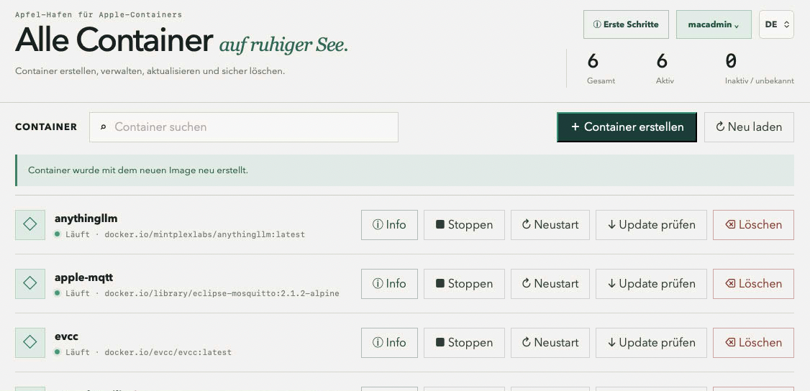

# Apfel-Hafen

[English version](README.md)

**Apfel-Hafen** ist eine lokale Weboberfläche zur Verwaltung von
Apple-Containern und benutzerbezogenen LaunchD-Diensten unter macOS 26. Sie
zeigt vorhandene Container und Dienste kompakt an, verwaltet deren Lebenszyklus
und prüft Container auf aktualisierte Images.

Die Oberfläche wird ausschließlich über HTTPS bereitgestellt und ist in der
lokalen Standardeinstellung unter `https://127.0.0.1:4173` erreichbar. Änderungen an Containern erfordern die
Anmeldung eines lokalen macOS-Administrators. Das Passwort wird über PAM
geprüft und nicht gespeichert.



## Sprachen

Die Oberfläche unterstützt Deutsch und Englisch. Beim ersten Start wird die
Browsersprache verwendet. Die Auswahl DE/EN in der Kopfzeile wird lokal im
Browser gespeichert.

## Voraussetzungen

- macOS 26 auf einem Apple-Silicon-Mac
- Apples `container`-CLI unter `/usr/local/bin/container`
- Node.js 20 oder neuer
- `pnpm`
- Xcode Command Line Tools zum Kompilieren des PAM-Hilfsprogramms

Prüfen Sie zunächst, ob der Apple-Containerdienst läuft:

```console
container system status
```

Falls der Dienst noch nicht läuft:

```console
container system start
```

## Installation

Ab Version 0.2.5 übernimmt die native `Apfel-Hafen.app` Ersteinrichtung,
LaunchAgent und Verwaltung, öffnet die Weboberfläche aber weiterhin im normalen
Browser. Technische Details stehen unter [docs/native-app.md](docs/native-app.md).

### Fertige Auslieferung

Jedes Release enthält das Server-Archiv `Apfel-Hafen-0.2.8-macos-arm64.zip`
und die native macOS-App als `Apfel-Hafen-0.2.8-macos-arm64.dmg`. Das Archiv
enthält die benötigte Node.js-Laufzeit, das kompilierte PAM-Hilfsprogramm und
die gebaute Weboberfläche. Apple-Container, Images, Volumes und Anwendungsdaten
sind nicht enthalten. Archiv entpacken und `Start-Apfel-Hafen.command` starten.

### Aus dem Quellcode

1. Repository laden und in den Projektordner wechseln:

   ```console
   git clone git@github.com:silberkugel/Apfel-Hafen.git
   cd Apfel-Hafen
   ```

2. JavaScript-Abhängigkeiten installieren:

   ```console
   pnpm install
   ```

3. Den lokalen PAM-Anmeldehelfer kompilieren:

   ```console
   cc auth/pam-auth.c -o auth/pam-auth -lpam
   ```

4. Die Weboberfläche bauen:

   ```console
   pnpm build
   ```

Das erzeugte PAM-Programm, die installierten Abhängigkeiten und die fertigen
Webdateien bleiben lokal und werden nicht in Git eingecheckt.

Mit `pnpm release` werden nach Tests und Build das vollständige Release-Archiv
und das DMG der nativen macOS-App unter `out/` erzeugt.

## Starten und Beenden

Zum Starten `Start-Apfel-Hafen.command` im Finder doppelklicken. Der
LaunchAgent wird für das aktuelle Benutzerkonto installiert beziehungsweise
aktualisiert, als Hintergrunddienst gestartet und die Oberfläche automatisch
im Browser geöffnet. Das kurz geöffnete Terminalfenster kann anschließend
geschlossen werden. Der Dienst startet bei späteren Anmeldungen automatisch.

Alternativ kann die Anwendung im Projektordner gestartet werden:

```console
pnpm start
```

Anschließend ist sie unter <https://127.0.0.1:4173> erreichbar.

Beim ersten Start erzeugt Apfel-Hafen automatisch ein selbstsigniertes
Serverzertifikat. Der Browser zeigt deshalb zunächst eine Zertifikatswarnung.
Das Zertifikat verschlüsselt die Verbindung dennoch; für einen Zugriff ohne
Warnung muss es auf dem Endgerät als vertrauenswürdig eingerichtet oder durch
ein Zertifikat einer vertrauten Zertifizierungsstelle ersetzt werden.

Zum Beenden für die aktuelle Sitzung `Stop-Apfel-Hafen.command`
doppelklicken. Ist der Autostart aktiviert, wird der Dienst bei der nächsten
Anmeldung wieder gestartet. Die Anwendung darf nicht mit `sudo` gestartet
werden, weil Apples Containerdienst zum angemeldeten Benutzer gehört.

### Hintergrunddienst und Autostart

Der Startbefehl richtet einen benutzerbezogenen LaunchAgent unter
`~/Library/LaunchAgents/de.apfel-hafen.service.plist` ein. Er läuft ohne
Oberfläche, Dock-Symbol und dauerhaft geöffnetes Terminal. Nach der
Administratoranmeldung kann der Autostart unter **Administration** ein- oder
ausgeschaltet werden. Die Anzeige unterscheidet Autostart und momentan
geladenen Dienst.

Der Netzwerkmodus ist davon unabhängig: `127.0.0.1` stellt Apfel-Hafen nur
auf dem Mac bereit, `0.0.0.0` zusätzlich über dessen Netzwerkadressen. Beim
Netzwerkzugriff sollten ein vertrauenswürdiges Zertifikat und eine restriktive
macOS-Firewall-Konfiguration verwendet werden.

## Handhabung

Die Dienstzentrale zeigt alle Apple-Container sowie benutzer- und systembezogene
LaunchD-Dienste mit ihrem aktuellen Status. Statusinformationen können ohne
Anmeldung angesehen werden; systemweite LaunchD-Dienste bleiben schreibgeschützt.

Für schreibende Aktionen melden Sie sich mit einem lokalen
macOS-Administratorkonto an. Danach stehen folgende Funktionen bereit:

- Container starten, stoppen und neu starten
- Start- und Containerprotokolle direkt in der Oberfläche anzeigen
- für laufende Container eine interaktive Konsole im Terminal öffnen
- Container mit Image-Suche, Portfreigaben, Volumes und Umgebungsvariablen erstellen
- Container nach Eingabe ihres Namens sicher löschen; optional können die von
  Apfel-Hafen verwalteten Volume-Daten mitgelöscht werden
- nach einer neueren Version des verwendeten Images suchen
- Container kontrolliert mit dem aktuellen Image ersetzen
- benutzerbezogene LaunchAgents erstellen, starten, stoppen, neu starten und
  verwaiste Konfigurationen bereinigen; als automatische Startarten stehen
  `RunAtLoad`, `KeepAlive`, `StartInterval` und mehrere
  `StartCalendarInterval`-Zeiten zur Verfügung
- den globalen Basispfad für von Apfel-Hafen verwaltete Volumes festlegen
- zwischen rein lokaler Erreichbarkeit (`127.0.0.1`) und Netzwerkzugriff
  (`0.0.0.0`) wechseln
- ein eigenes PEM-Serverzertifikat mit passendem privaten Schlüssel aktivieren
  oder wieder auf das automatisch erzeugte Zertifikat zurückschalten
- LaunchAgent installieren oder aktualisieren und den Autostart ändern

Zertifikate und private Schlüssel werden unter
`~/Library/Application Support/Apfel-Hafen/tls/` außerhalb der Weboberfläche
gespeichert. Der private Schlüssel ist nur für den ausführenden Benutzer
lesbar. HTTP-Verbindungen werden nicht angenommen.

Vor dem Ersetzen eines Containers legt Apfel-Hafen unter
`~/Library/Application Support/Apfel-Hafen/backups/<Containername>/` eine
Sicherung seiner Konfiguration an und prüft die
neue Konfiguration zunächst mit einem Probe-Container. Eingebundene
Host-Verzeichnisse bleiben erhalten. Daten, die ausschließlich im
beschreibbaren Root-Dateisystem des Containers liegen, können beim Ersetzen
verloren gehen.

## Deinstallation

1. Apfel-Hafen mit `Stop-Apfel-Hafen.command` beenden.
2. Falls der Autostart eingerichtet wurde, den LaunchAgent entladen:

   ```console
   launchctl bootout "gui/$(id -u)" "$HOME/Library/LaunchAgents/de.apfel-hafen.service.plist"
   ```

3. Die Datei `de.apfel-hafen.service.plist` aus
   `~/Library/LaunchAgents` entfernen.
4. Benötigte Konfigurationssicherungen aus dem Ordner `backups` an einen
   sicheren Ort kopieren.
5. Den Projektordner im Finder in den Papierkorb verschieben.
6. Optional den Protokollordner
   `~/Library/Logs/Apfel-Hafen` entfernen.

Die Deinstallation von Apfel-Hafen entfernt **keine** Apple-Container,
Images, Volumes oder eingebundenen Host-Daten. Diese werden bei Bedarf separat
mit Apples `container`-CLI verwaltet.

## Quellen

- [apple/container](https://github.com/apple/container)

## Lizenz

Dieses Projekt steht unter der [GNU General Public License Version 3](LICENSE).
