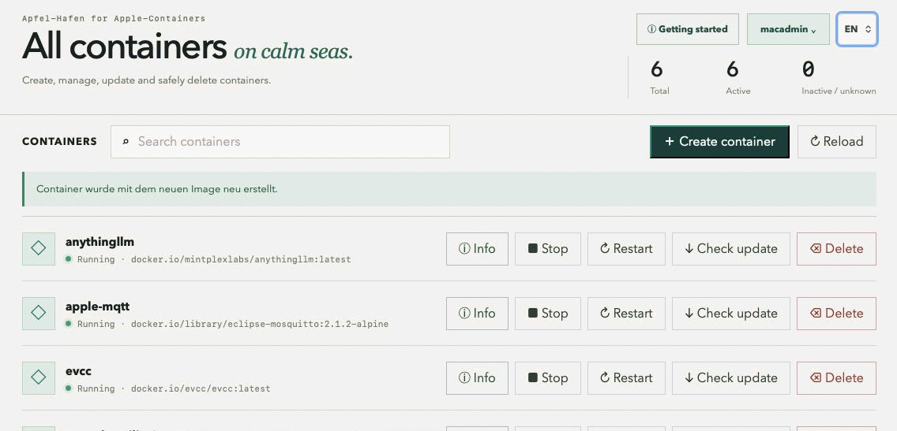

# Apfel-Hafen

[Deutsche Version](README-DE.md)

**Apfel-Hafen** is a local web interface for managing Apple containers on
macOS 26. It displays existing containers in a compact layout and lets you
create, start, stop, restart, safely delete, and check them for updated images.

The interface is served exclusively over HTTPS and is available in the default
local configuration at `https://127.0.0.1:4173`.
Changing containers requires signing in with a local macOS administrator
account. The password is verified through PAM and is not stored.



## Languages

The interface supports German and English. On first launch, it uses the
browser language. The DE/EN selection in the header is stored locally in the
browser.

## Prerequisites

- macOS 26 on an Apple Silicon Mac
- Apple's `container` CLI at `/usr/local/bin/container`
- Node.js 20 or newer
- `pnpm`
- Xcode Command Line Tools for compiling the PAM authentication helper

First, check whether Apple Container service is running:

```console
container system status
```

If the service is not running yet:

```console
container system start
```

## Installation

Starting with version 0.2.4, the native `Apfel-Hafen.app` handles initial setup,
LaunchAgent registration, and service management while the web interface
continues to open in the regular browser. See [docs/native-app.md](docs/native-app.md)
for technical details.

### Ready-to-use release

The `Apfel-Hafen-0.2.4-macos-arm64.zip` archive contains the required Node.js
runtime, compiled PAM helper, and built web interface. Apple containers,
images, volumes, and application data are not included. Extract the archive
and run `Start-Apfel-Hafen.command`.

### From source

1. Clone the repository and change to the project directory:

   ```console
   git clone git@github.com:silberkugel/Apfel-Hafen.git
   cd Apfel-Hafen
   ```

2. Install the JavaScript dependencies:

   ```console
   pnpm install
   ```

3. Compile the local PAM authentication helper:

   ```console
   cc auth/pam-auth.c -o auth/pam-auth -lpam
   ```

4. Build the web interface:

   ```console
   pnpm build
   ```

The compiled PAM helper, installed dependencies, and generated web files stay
local and are not committed to Git.

Run `pnpm release` to test and build a complete release archive under `out/`.

## Starting and stopping

Double-click `Start-Apfel-Hafen.command` in Finder. The local service
installs or updates the LaunchAgent for the current user account, starts it in
the background, and opens the interface automatically in the browser. The
briefly opened Terminal window can then be closed. The service starts
automatically on subsequent sign-ins.

Alternatively, start the application from the project directory:

```console
pnpm start
```

The interface is then available at <https://127.0.0.1:4173>.

On first launch, Apfel-Hafen automatically generates a self-signed server
certificate. The browser therefore initially displays a certificate warning.
The connection is still encrypted; to avoid the warning, trust the certificate
on the client device or replace it with one issued by a trusted certificate
authority.

To stop the application for the current session, double-click
`Stop-Apfel-Hafen.command`. If automatic start is enabled, the service starts
again at the next sign-in. Do not start the application with `sudo`, because
Apple Container service belongs to the signed-in user.

### Background service and automatic start

The start command installs a per-user LaunchAgent at
`~/Library/LaunchAgents/de.apfel-hafen.service.plist`. It runs without a user
interface, Dock icon, or permanently open Terminal. After administrator
sign-in, automatic start can be enabled or disabled under **Administration**.
The display distinguishes automatic start from the currently loaded service.

The network mode is independent of the service lifecycle: `127.0.0.1` exposes
Apfel-Hafen only on the Mac, while `0.0.0.0` also exposes it on the Mac's
network addresses. Network access should be combined with a trusted
certificate and a restrictive macOS firewall configuration.

## Usage

The home page lists all Apple containers with their names, images, and current
status. Status information can be viewed without signing in.

For administrative actions, sign in with a local macOS administrator account.
The following functions are then available:

- start, stop, and restart containers
- create containers with image search, port mappings, volumes, and environment variables
- safely delete containers after confirming their names; optionally delete
  volume data managed by Apfel-Hafen as well
- check for a newer version of the image in use
- safely replace a container with the current image
- configure the global base path for volumes managed by Apfel-Hafen
- switch between local-only access (`127.0.0.1`) and network access (`0.0.0.0`)
- activate a custom PEM server certificate with its matching private key or
  switch back to the automatically generated certificate
- install or update the LaunchAgent and change its automatic-start status

Certificates and private keys are stored outside the web interface under
`~/Library/Application Support/Apfel-Hafen/tls/`. The private key is readable
only by the account running the service. Plain HTTP connections are not
accepted.

Before replacing a container, Apfel-Hafen saves its configuration under
`~/Library/Application Support/Apfel-Hafen/backups/<Containername>/` and
verifies the new configuration with a temporary test container. Mounted host
directories remain intact. Data stored only in
the container's writable root filesystem may be lost during replacement.

## Uninstallation

1. Stop Apfel-Hafen with `Stop-Apfel-Hafen.command`.
2. If automatic start was configured, unload the LaunchAgent:

   ```console
   launchctl bootout "gui/$(id -u)" "$HOME/Library/LaunchAgents/de.apfel-hafen.service.plist"
   ```

3. Remove `de.apfel-hafen.service.plist` from
   `~/Library/LaunchAgents`.
4. Copy any required configuration backups from the `backups` directory to a
   safe location.
5. Move the project directory to the Trash in Finder.
6. Optionally remove the log directory
   `~/Library/Logs/Apfel-Hafen`.

Uninstalling Apfel-Hafen does **not** remove Apple containers, images,
volumes, or mounted host data. Manage them separately with Apple's `container`
CLI if needed.

## Sources

- [apple/container](https://github.com/apple/container)

## License

This project is licensed under the [GNU General Public License Version 3](LICENSE).
